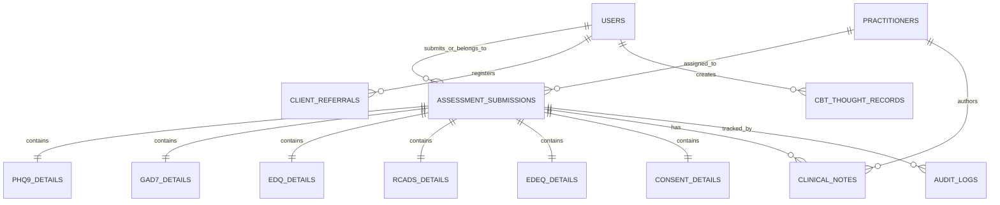

# Backend & Admin Dashboard Specification: Self-Assessment Forms CRUD & Clinical Management

**Document Version:** 1.0.0  
**Target Platform:** Ontime Therapy / digimed Web Application & Admin CRM Platform  
**Target Audiences:** Backend Engineers, Full-Stack Engineers, Frontend UI Engineers, Clinical Administrators  
**Compliance Standards:** UK GDPR, Data Protection (Jersey) Law 2018, ACCPH & NMC Ethical Frameworks  

---

## 1. Executive Summary & Architectural Objectives

### 1.1 Purpose
This specification defines the complete technical, architectural, and user-interface blueprints for building backend APIs, database schemas, and Admin Dashboard views for **all Self-Assessment Forms, Clinical Questionnaires, Intake Referrals, Consent Policies, and CBT Interactive Tools** in the Ontime Therapy platform.

### 1.2 Target Form Ecosystem
The platform includes the following self-assessment, screening, intake, and therapeutic tools:
1. **PHQ-9 Depression Screener** (9 items, 0–27 severity score, suicide ideation risk flag)
2. **GAD-7 Anxiety Screener** (7 items, 0–21 severity score)
3. **EDQ Eating Disorder Screener** (10 items, 0–30 severity score)
4. **RCADS-47 Anxiety & Depression Screener** (47 items, dual-mode: Child & Parent/Carer, 6 clinical subscales, demographics & NHS identifier)
5. **EDE-Q 6.0 Full Assessment** (28 items: 22 Likert items, 6 behavioral frequency counters, 4 subscales, Global Score 0–6, BMI calculator, menstrual history & contraceptive data)
6. **Client Self-Referral Form** (Full intake triage: personal details, communication preferences, therapeutic goals, medical/psychiatric history, risk disclosure, GP surgery & consent, electronic signature)
7. **Client Consent Form** (Routine clinical info sharing consent, safeguarding consent, dual client/clinician electronic signatures)
8. **Confidentiality & Consent Policy Document** (Dual-consent agreement, Gillick competency for young people aged 11–17, parent/carer involvement, dual signatures)
9. **Online Counselling Agreement** (Therapeutic terms, modality selection, safety & emergency protocols, digital sign-off)
10. **Interactive CBT Thought Records** (Situation/trigger, automatic thoughts, cognitive distortions, rational challenge, before/after mood ratings 0–100%)
11. **Consultation Requests & Appointment Booking Intakes** (15-min phone consultations & full multi-step booking leads with CRM forwarding)

### 1.3 Core Engineering Goals
- **Full CRUD Capabilities:** Create, Read (List & Detail), Update (Status, Notes, Triage, Assignments), and Soft Delete / Archive submissions.
- **Unified & Granular Ingestion:** RESTful JSON endpoints with rigorous runtime payload validation (e.g. Zod / Joi / Pydantic / class-validator).
- **Automated Clinical Scoring & Risk Triggering:** Automated calculation of subscale scores, global scores, and instant emergency alerts for high-risk flags (e.g. PHQ-9 Q9 > 0, frequent purging/vomiting in EDE-Q, self-harm/violence disclosures in self-referrals).
- **Role-Based Access Control (RBAC):** Super Admin, Lead Clinician, Assigned Therapist, Audit/Read-Only.
- **Audit Logging & GDPR Compliance:** Immutable audit logs tracking who viewed, edited, exported, or deleted patient clinical records.

---

## 2. Database Schema & Data Models

### 2.1 Entity Relationship Diagram (ERD Overview)



---

### 2.2 Relational Tables Definition (SQL DDL Specification)

#### Table: `assessment_submissions` (Master Polymorphic Table)
Central master registry for all submissions across all form types.

```sql
CREATE TYPE assessment_form_type AS ENUM (
    'PHQ9',
    'GAD7',
    'EDQ',
    'RCADS47',
    'EDEQ6',
    'SELF_REFERRAL',
    'CONSENT_FORM',
    'CONFIDENTIALITY_POLICY',
    'COUNSELLING_AGREEMENT'
);

CREATE TYPE submission_status AS ENUM (
    'PENDING_REVIEW',
    'REVIEWED',
    'TRIAGED',
    'ACTION_REQUIRED',
    'ARCHIVED'
);

CREATE TYPE risk_severity_level AS ENUM (
    'MINIMAL',
    'MILD',
    'MODERATE',
    'MODERATELY_SEVERE',
    'SEVERE',
    'CRITICAL_SAFEGUARDING'
);

CREATE TABLE assessment_submissions (
    id UUID PRIMARY KEY DEFAULT gen_random_uuid(),
    client_id UUID NULL REFERENCES users(id) ON DELETE SET NULL,
    assigned_therapist_id UUID NULL REFERENCES practitioners(id) ON DELETE SET NULL,
    
    form_type assessment_form_type NOT NULL,
    form_version VARCHAR(20) NOT NULL DEFAULT '1.0',
    
    -- Submitter Demographics (captured even for non-registered users)
    client_name VARCHAR(255) NOT NULL,
    client_email VARCHAR(255) NULL,
    client_phone VARCHAR(50) NULL,
    nhs_number VARCHAR(50) NULL,
    date_of_birth DATE NULL,
    
    -- Status and Triage
    status submission_status NOT NULL DEFAULT 'PENDING_REVIEW',
    risk_level risk_severity_level NOT NULL DEFAULT 'MINIMAL',
    has_safeguarding_flag BOOLEAN NOT NULL DEFAULT FALSE,
    safeguarding_reason TEXT NULL,
    
    -- Scoring Summary
    total_score NUMERIC(6,2) NULL,
    max_score NUMERIC(6,2) NULL,
    score_percentage NUMERIC(5,2) NULL,
    severity_label VARCHAR(100) NULL,
    
    -- JSON Payloads for raw items & calculated metrics
    raw_responses JSONB NOT NULL,
    calculated_subscales JSONB NULL,
    metadata JSONB NULL, -- IP, User-Agent, referral source, mode (child/parent)
    
    -- Signatures & Legal
    signature_data JSONB NULL, -- electronic signature name, date, IP
    is_signed BOOLEAN NOT NULL DEFAULT FALSE,
    signed_at TIMESTAMPTZ NULL,
    
    -- Timestamps & Soft Delete
    created_at TIMESTAMPTZ NOT NULL DEFAULT NOW(),
    updated_at TIMESTAMPTZ NOT NULL DEFAULT NOW(),
    reviewed_at TIMESTAMPTZ NULL,
    reviewed_by UUID NULL REFERENCES practitioners(id),
    deleted_at TIMESTAMPTZ NULL
);

CREATE INDEX idx_assessments_type_status ON assessment_submissions(form_type, status);
CREATE INDEX idx_assessments_risk_level ON assessment_submissions(risk_level, has_safeguarding_flag);
CREATE INDEX idx_assessments_created_at ON assessment_submissions(created_at DESC);
CREATE INDEX idx_assessments_client_email ON assessment_submissions(client_email);
CREATE INDEX idx_assessments_nhs_number ON assessment_submissions(nhs_number);
```

---

#### Table: `client_self_referrals` (Full Intake Triage Model)
For storing comprehensive self-referral applications.

```sql
CREATE TABLE client_self_referrals (
    id UUID PRIMARY KEY DEFAULT gen_random_uuid(),
    submission_id UUID UNIQUE REFERENCES assessment_submissions(id) ON DELETE CASCADE,
    client_id UUID NULL REFERENCES users(id) ON DELETE SET NULL,
    
    -- Personal Information
    full_name VARCHAR(255) NOT NULL,
    date_of_birth DATE NOT NULL,
    residential_address TEXT NOT NULL,
    phone_number VARCHAR(50) NOT NULL,
    emergency_contact VARCHAR(255) NOT NULL,
    email_address VARCHAR(255) NOT NULL,
    best_time_to_contact VARCHAR(255) NULL,
    preferred_method VARCHAR(100) NOT NULL, -- 'Zoom Video', 'Zoom Audio', 'Chat', 'Email', 'Phone'
    
    -- Clinical Focus & History
    presenting_issue TEXT NOT NULL,
    previous_counselling TEXT NULL,
    medical_psychiatric_history TEXT NULL,
    upcoming_appointments TEXT NULL,
    risk_history TEXT NULL, -- Self-harm, overdose, violence
    
    -- GP Surgery Details
    gp_details TEXT NOT NULL,
    gp_consent VARCHAR(10) NOT NULL CHECK (gp_consent IN ('YES', 'NO')),
    
    -- Agreement & Signature
    counselling_agreement_confirmed BOOLEAN NOT NULL DEFAULT FALSE,
    signature VARCHAR(255) NOT NULL,
    signature_date DATE NOT NULL,
    
    -- Triage & Processing
    triage_notes TEXT NULL,
    assigned_therapist_id UUID NULL REFERENCES practitioners(id),
    status submission_status NOT NULL DEFAULT 'PENDING_REVIEW',
    
    created_at TIMESTAMPTZ NOT NULL DEFAULT NOW(),
    updated_at TIMESTAMPTZ NOT NULL DEFAULT NOW()
);
```

---

#### Table: `cbt_thought_records` (Patient & Admin Thought Restructuring Logs)

```sql
CREATE TABLE cbt_thought_records (
    id UUID PRIMARY KEY DEFAULT gen_random_uuid(),
    client_id UUID NULL REFERENCES users(id) ON DELETE CASCADE,
    
    record_date DATE NOT NULL DEFAULT CURRENT_DATE,
    situation TEXT NOT NULL,
    automatic_thought TEXT NOT NULL,
    distortions JSONB NOT NULL DEFAULT '[]'::jsonb, -- e.g. ["Catastrophizing", "Mind Reading"]
    rational_challenge TEXT NOT NULL,
    mood_pre INTEGER NOT NULL CHECK (mood_pre >= 0 AND mood_pre <= 100),
    mood_post INTEGER NOT NULL CHECK (mood_post >= 0 AND mood_post <= 100),
    
    clinician_feedback TEXT NULL,
    reviewed_by UUID NULL REFERENCES practitioners(id),
    is_flagged_for_session BOOLEAN NOT NULL DEFAULT FALSE,
    
    created_at TIMESTAMPTZ NOT NULL DEFAULT NOW(),
    updated_at TIMESTAMPTZ NOT NULL DEFAULT NOW()
);

CREATE INDEX idx_cbt_client_id ON cbt_thought_records(client_id, record_date DESC);
```

---

#### Table: `clinical_notes_and_actions` (Clinician Triage & Follow-up Log)

```sql
CREATE TABLE clinical_notes_and_actions (
    id UUID PRIMARY KEY DEFAULT gen_random_uuid(),
    assessment_id UUID NOT NULL REFERENCES assessment_submissions(id) ON DELETE CASCADE,
    author_id UUID NOT NULL REFERENCES practitioners(id),
    
    note_type VARCHAR(50) NOT NULL DEFAULT 'GENERAL_REVIEW', -- 'GENERAL_REVIEW', 'SAFEGUARDING_ESCALATION', 'GP_CONTACTED', 'SESSION_FOLLOWUP'
    note_content TEXT NOT NULL,
    is_confidential_supervision BOOLEAN NOT NULL DEFAULT FALSE,
    
    created_at TIMESTAMPTZ NOT NULL DEFAULT NOW()
);
```

---

#### Table: `assessment_audit_logs` (GDPR & NHS Compliance)

```sql
CREATE TABLE assessment_audit_logs (
    id UUID PRIMARY KEY DEFAULT gen_random_uuid(),
    assessment_id UUID NOT NULL REFERENCES assessment_submissions(id) ON DELETE CASCADE,
    actor_id UUID NULL REFERENCES users(id),
    actor_role VARCHAR(50) NOT NULL,
    action_type VARCHAR(50) NOT NULL, -- 'VIEW', 'UPDATE_STATUS', 'ASSIGN_THERAPIST', 'EDIT_NOTE', 'EXPORT_PDF', 'SOFT_DELETE'
    previous_state JSONB NULL,
    new_state JSONB NULL,
    ip_address VARCHAR(45) NULL,
    user_agent TEXT NULL,
    created_at TIMESTAMPTZ NOT NULL DEFAULT NOW()
);
```

---

## 3. Backend REST API Endpoints Specification

### 3.1 Authentication & Authorization
- **Public Client Endpoints:** Open with rate limiting (IP-based, 10 submissions/minute) and CAPTCHA / bot protection.
- **Admin Endpoints:** Require HTTP Authorization header: `Bearer <JWT_TOKEN>` with Claims:
  - `role`: `ADMIN`, `SUPER_ADMIN`, `LEAD_CLINICIAN`, `THERAPIST`
  - Therapists can only view and update assessments assigned to them, unless they hold `ADMIN` or `LEAD_CLINICIAN` permissions.

---

### 3.2 Public Form Submissions API

#### 1. Unified Assessment Submission Endpoint
- **URL:** `POST /api/v1/assessments/submit`
- **Description:** Receives submissions for PHQ-9, GAD-7, EDQ, RCADS-47, and EDE-Q 6.0.
- **Request Headers:** `Content-Type: application/json`

##### Request Payload Example: RCADS-47
```json
{
  "formType": "RCADS47",
  "mode": "child",
  "clientName": "James Miller",
  "clientEmail": "parent@example.com",
  "clientPhone": "07497208249",
  "nhsNumber": "456 789 0123",
  "dateOfBirth": "2012-05-14",
  "relationship": "Parent",
  "submissionDateTime": "2026-08-10T21:30:00Z",
  "responses": {
    "1": 2, "2": 3, "3": 1, "4": 0, "5": 2,
    "6": 3, "7": 1, "8": 2, "9": 3, "10": 1,
    "11": 2, "12": 1, "13": 2, "14": 1, "15": 2,
    "16": 0, "17": 1, "18": 1, "19": 2, "20": 2,
    "21": 2, "22": 1, "23": 0, "24": 1, "25": 2,
    "26": 1, "27": 1, "28": 1, "29": 2, "30": 1,
    "31": 0, "32": 1, "33": 0, "34": 1, "35": 2,
    "36": 1, "37": 2, "38": 0, "39": 1, "40": 2,
    "41": 1, "42": 0, "43": 1, "44": 0, "45": 2,
    "46": 1, "47": 2
  }
}
```

##### Backend Validation & Automatic Scoring Logic:
1. Validates all 47 questions are present with integers between 0 and 3.
2. Calculates subscales:
   - **Separation Anxiety (SAD):** Items `[5, 9, 13, 17, 18, 22, 27, 46]` (Max 24)
   - **Social Phobia (SoP):** Items `[4, 7, 8, 12, 20, 30, 32, 38, 43]` (Max 27)
   - **Obsessive-Compulsive (OCD):** Items `[10, 16, 23, 31, 42, 44]` (Max 18)
   - **Panic Disorder (PD):** Items `[3, 14, 24, 26, 28, 34, 36, 39, 41]` (Max 27)
   - **Generalized Anxiety (GAD):** Items `[1, 35, 45, 47]` (Max 12)
   - **Major Depression (MDD):** Items `[2, 6, 11, 15, 19, 21, 25, 29, 37, 40]` (Max 30)
3. Total score = sum of all 47 items (Max 141).
4. Checks safeguarding: If MDD > 20 or specific items indicate acute distress, flag `has_safeguarding_flag = true` and `risk_level = 'SEVERE'`.
5. Sends notification email via SMTP/SendGrid.

##### Response (201 Created):
```json
{
  "success": true,
  "submissionId": "f47ac10b-58cc-4372-a567-0e02b2c3d479",
  "formType": "RCADS47",
  "totalScore": 58,
  "maxScore": 141,
  "severityLabel": "Moderate Anxiety & Depressive Symptoms",
  "subscales": [
    { "name": "Separation Anxiety (SAD)", "score": 11, "maxScore": 24, "percentage": 46 },
    { "name": "Social Phobia (SoP)", "score": 9, "maxScore": 27, "percentage": 33 },
    { "name": "Obsessive-Compulsive (OCD)", "score": 2, "maxScore": 18, "percentage": 11 },
    { "name": "Panic Disorder (PD)", "score": 8, "maxScore": 27, "percentage": 30 },
    { "name": "Generalized Anxiety (GAD)", "score": 7, "maxScore": 12, "percentage": 58 },
    { "name": "Major Depression (MDD)", "score": 21, "maxScore": 30, "percentage": 70 }
  ],
  "recommendation": "Moderate symptoms detected. Booking a specialist consultation is recommended.",
  "createdAt": "2026-08-10T21:30:00Z"
}
```

---

#### 2. EDE-Q 6.0 Assessment Submission Endpoint
- **URL:** `POST /api/v1/assessments/edeq`
- **Request Payload Example:**
```json
{
  "formType": "EDEQ6",
  "clientName": "Sophie Taylor",
  "clientEmail": "sophie.t@example.com",
  "clientPhone": "07700900123",
  "responses": {
    "1": 4, "2": 3, "3": 5, "4": 4, "5": 2, "6": 5, "7": 4,
    "8": 6, "9": 3, "10": 5, "11": 4, "12": 5,
    "19": 3, "20": 4, "21": 3,
    "22": 5, "23": 6, "24": 4, "25": 5, "26": 6, "27": 4, "28": 5
  },
  "behavioral": {
    "13": 8,
    "14": 6,
    "15": 5,
    "16": 4,
    "17": 0,
    "18": 12
  },
  "additionalInfo": {
    "weight": 54.5,
    "height": 168.0,
    "missedPeriods": "yes",
    "numMissedPeriods": 3,
    "takingPill": "no"
  }
}
```

##### Automated Scoring Logic:
- **Subscales:**
  - Restraint: Average of items `1, 2, 3, 4, 5`
  - Eating Concern: Average of items `7, 9, 19, 20, 21`
  - Shape Concern: Average of items `6, 8, 10, 11, 23, 26, 27, 28`
  - Weight Concern: Average of items `8, 12, 22, 24, 25, 26`
- **Global Score:** Average of the 4 subscale scores (0.00 – 6.00).
- **BMI Calculation:** $\text{weight (kg)} / (\text{height (m)})^2$
- **High-Risk Purging / Binge Trigger:** Behavioral item 16 (vomiting) $\ge 4$ or item 18 (driven exercise) $\ge 12 \rightarrow$ `has_safeguarding_flag = true`, `risk_level = 'CRITICAL_SAFEGUARDING'`.

---

#### 3. Client Self-Referral Submission Endpoint
- **URL:** `POST /api/v1/referrals`
- **Request Payload:**
```json
{
  "fullName": "Eleanor Vance",
  "dob": "1994-08-15",
  "address": "42 High Street, St Helier, Jersey, JE2 4BA",
  "phone": "07497 208249",
  "emergencyContact": "David Vance (Spouse) - 07497 999888",
  "email": "eleanor.vance@example.com",
  "bestTimeToContact": "Mornings 9am - 12pm",
  "preferredMethod": "Zoom Webcam (Video)",
  "presentingIssue": "Experiencing severe workplace panic attacks and persistent low mood.",
  "previousCounselling": "6 sessions of Person-Centred counselling in 2023.",
  "medicalHistory": "Hypothyroidism (Levothyroxine 50mcg daily). No psychiatric admissions.",
  "upcomingAppointments": "GP checkup next month.",
  "riskHistory": "Occasional passive suicidal thoughts during peak panic; no intent, no plan.",
  "gpDetails": "Dr. Sarah Jenkins, St Helier Medical Practice, St Helier, Jersey. Tel: 01534 888999",
  "gpConsent": "YES",
  "counsellingAgreementConfirmed": true,
  "signature": "/Eleanor Vance/",
  "signDate": "2026-08-10"
}
```

---

#### 4. Consent & Confidentiality Policy Sign-Off Endpoint
- **URL:** `POST /api/v1/agreements/sign`
- **Request Payload:**
```json
{
  "documentType": "CONSENT_FORM",
  "clientName": "Eleanor Vance",
  "consentRoutineCare": true,
  "consentSafeguarding": true,
  "digitalSignature": "/Eleanor Vance/",
  "signedDate": "2026-08-10",
  "clinicianName": "Anotida Macdonald Nduna",
  "clinicianSignature": "/A. M. Nduna/",
  "clinicianDate": "2026-08-10"
}
```

---

### 3.3 Admin Dashboard Management Endpoints (CRUD)

#### 1. List All Submissions (with Multi-Filter & Search)
- **URL:** `GET /api/v1/admin/assessments`
- **Auth Required:** `Bearer <JWT>` (Roles: `ADMIN`, `LEAD_CLINICIAN`, `THERAPIST`)
- **Query Parameters:**
  - `page` (integer, default: 1)
  - `limit` (integer, default: 20, max: 100)
  - `formType` (string: `ALL`, `PHQ9`, `GAD7`, `EDQ`, `RCADS47`, `EDEQ6`, `SELF_REFERRAL`, `CONSENT_FORM`)
  - `status` (string: `ALL`, `PENDING_REVIEW`, `REVIEWED`, `TRIAGED`, `ACTION_REQUIRED`, `ARCHIVED`)
  - `riskLevel` (string: `ALL`, `MINIMAL`, `MILD`, `MODERATE`, `MODERATELY_SEVERE`, `SEVERE`, `CRITICAL_SAFEGUARDING`)
  - `hasSafeguardingFlag` (boolean: `true` / `false`)
  - `search` (string: matches client name, email, phone, or NHS number)
  - `startDate` & `endDate` (ISO 8601 strings)
  - `therapistId` (UUID)
  - `sortBy` (string: `created_at`, `risk_level`, `total_score`, `client_name`)
  - `sortOrder` (`ASC` | `DESC`, default: `DESC`)

##### Sample Response (200 OK):
```json
{
  "data": [
    {
      "id": "f47ac10b-58cc-4372-a567-0e02b2c3d479",
      "formType": "RCADS47",
      "clientName": "James Miller",
      "clientEmail": "parent@example.com",
      "clientPhone": "07497208249",
      "nhsNumber": "456 789 0123",
      "status": "ACTION_REQUIRED",
      "riskLevel": "SEVERE",
      "hasSafeguardingFlag": true,
      "totalScore": 58,
      "maxScore": 141,
      "severityLabel": "Moderate Anxiety & Depressive Symptoms",
      "assignedTherapist": {
        "id": "c1234567-89ab-cdef-0123-456789abcdef",
        "name": "Anotida Macdonald Nduna"
      },
      "notesCount": 3,
      "createdAt": "2026-08-10T21:30:00Z",
      "updatedAt": "2026-08-10T21:45:00Z"
    }
  ],
  "pagination": {
    "currentPage": 1,
    "totalPages": 14,
    "totalItems": 278,
    "limit": 20,
    "hasNextPage": true,
    "hasPrevPage": false
  },
  "metrics": {
    "totalSubmissions": 278,
    "pendingReviewCount": 18,
    "safeguardingAlertsCount": 5,
    "reviewedThisWeek": 42
  }
}
```

---

#### 2. Get Single Assessment Details (Granular View)
- **URL:** `GET /api/v1/admin/assessments/:id`
- **Auth Required:** `Bearer <JWT>`
- **Response (200 OK):**
```json
{
  "id": "f47ac10b-58cc-4372-a567-0e02b2c3d479",
  "formType": "RCADS47",
  "formVersion": "1.0",
  "client": {
    "id": "u9876543-21ba-dcfe-ba98-7654321fedcb",
    "name": "James Miller",
    "email": "parent@example.com",
    "phone": "07497208249",
    "nhsNumber": "456 789 0123",
    "dob": "2012-05-14",
    "relationship": "Parent"
  },
  "status": "ACTION_REQUIRED",
  "riskLevel": "SEVERE",
  "hasSafeguardingFlag": true,
  "safeguardingReason": "MDD subscale indicates acute low mood and passive death thoughts (Q44=2).",
  "assignedTherapist": {
    "id": "c1234567-89ab-cdef-0123-456789abcdef",
    "name": "Anotida Macdonald Nduna",
    "email": "admin@ontimetherapy.com"
  },
  "scoring": {
    "totalScore": 58,
    "maxScore": 141,
    "percentage": 41.13,
    "severityLabel": "Moderate Anxiety & Depressive Symptoms",
    "subscales": [
      { "name": "Separation Anxiety (SAD)", "score": 11, "maxScore": 24, "percentage": 46 },
      { "name": "Social Phobia (SoP)", "score": 9, "maxScore": 27, "percentage": 33 },
      { "name": "Obsessive-Compulsive (OCD)", "score": 2, "maxScore": 18, "percentage": 11 },
      { "name": "Panic Disorder (PD)", "score": 8, "maxScore": 27, "percentage": 30 },
      { "name": "Generalized Anxiety (GAD)", "score": 7, "maxScore": 12, "percentage": 58 },
      { "name": "Major Depression (MDD)", "score": 21, "maxScore": 30, "percentage": 70 }
    ]
  },
  "questionResponses": [
    { "index": 1, "question": "I worry about things", "score": 2, "selectedText": "Often" },
    { "index": 2, "question": "I feel sad or empty", "score": 3, "selectedText": "Always" }
  ],
  "signatures": {
    "clientSignature": "/Eleanor Vance/",
    "signedAt": "2026-08-10T21:30:00Z",
    "ipAddress": "192.168.1.1"
  },
  "clinicalNotes": [
    {
      "id": "n1",
      "authorName": "Anotida Macdonald Nduna",
      "noteType": "SAFEGUARDING_ESCALATION",
      "content": "Parent contacted via phone at 10:00 AM. Triage booked for tomorrow afternoon.",
      "createdAt": "2026-08-11T09:15:00Z"
    }
  ],
  "auditHistory": [
    {
      "action": "UPDATE_STATUS",
      "actorName": "Anotida Macdonald",
      "from": "PENDING_REVIEW",
      "to": "ACTION_REQUIRED",
      "timestamp": "2026-08-11T09:10:00Z"
    }
  ],
  "createdAt": "2026-08-10T21:30:00Z",
  "updatedAt": "2026-08-11T09:15:00Z"
}
```

---

#### 3. Update Status, Assign Therapist, or Add Clinical Notes (Update)
- **URL:** `PATCH /api/v1/admin/assessments/:id`
- **Request Payload:**
```json
{
  "status": "TRIAGED",
  "assignedTherapistId": "c1234567-89ab-cdef-0123-456789abcdef",
  "riskLevel": "MODERATE",
  "hasSafeguardingFlag": false,
  "clinicalNote": {
    "noteType": "GENERAL_REVIEW",
    "content": "Assessed by clinical team. Cleared for online CBT video sessions."
  }
}
```
- **Response (200 OK):** Returns updated record with audit log appended.

---

#### 4. Manual Ingestion (Create by Clinician)
- **URL:** `POST /api/v1/admin/assessments`
- **Description:** Allows clinicians to enter paper assessment forms or historical client records directly from the admin dashboard.
- **Request Payload:** Same structure as client submission, plus `assignedTherapistId`, `status`, and `initialNotes`.
- **Response:** `201 Created`

---

#### 5. Soft Delete / Archive Assessment (Delete)
- **URL:** `DELETE /api/v1/admin/assessments/:id`
- **Query Param:** `hardDelete=false` (Default: soft delete; only Super Admin can request hard delete subject to 7-year medical retention rules).
- **Response (200 OK):**
```json
{
  "success": true,
  "message": "Assessment submission f47ac10b archived successfully."
}
```

---

#### 6. Bulk Actions (Batch Processing)
- **URL:** `POST /api/v1/admin/assessments/bulk`
- **Request Payload:**
```json
{
  "submissionIds": [
    "f47ac10b-58cc-4372-a567-0e02b2c3d479",
    "a12bc34d-56ef-7890-gh12-345678ijkl90"
  ],
  "action": "ASSIGN_THERAPIST", // 'UPDATE_STATUS', 'ASSIGN_THERAPIST', 'ARCHIVE', 'EXPORT_ZIP'
  "payload": {
    "therapistId": "c1234567-89ab-cdef-0123-456789abcdef"
  }
}
```

---

#### 7. Export & PDF Generation Endpoint
- **URL:** `GET /api/v1/admin/assessments/:id/export?format=pdf` (or `format=json` / `format=csv`)
- **Description:** Streams a signed, clinical-grade PDF summary containing official Ontime Therapy letterhead, scores, subscales, and legal signatures.

---

## 4. Admin Dashboard Views & UI/UX Specifications

The Admin Dashboard must be structured into 5 core views:

```
Admin Dashboard > Assessments & Clinical Intake Hub
├── 1. Master Submissions List & Triage Feed
├── 2. Single Assessment Clinical Detail & Scoring View
├── 3. Specialized Form Deep-Dives (RCADS Matrix, EDE-Q Behavioral, Referral Intake)
├── 4. Manual Entry / Edit Drawer Modal
└── 5. Clinical Analytics & Population Outcomes View
```

---

### 4.1 View 1: Master Submissions List & Triage Feed

#### Visual Layout & Key UI Components:
1. **Clinical KPI Stat Cards (Top Row):**
   - **Total Intake Forms** (with 30-day trend sparkline)
   - **Awaiting Review** (Amber badge highlighting forms requiring clinician sign-off)
   - **Active Safeguarding Alerts** (Pulsing Red indicator for high-risk / crisis disclosures)
   - **Triage Completion Rate** (Percentage triaged within target 48-hour window)
2. **Global Filter & Search Control Bar:**
   - **Form Type Tabs / Dropdown:** All, PHQ-9, GAD-7, EDQ, RCADS-47, EDE-Q 6.0, Self-Referral, Consent Forms, Thought Records.
   - **Risk Level Filter:** Minimal (Green), Mild (Lime), Moderate (Yellow), Moderately Severe (Orange), Severe (Red), Critical Safeguarding (Dark Red).
   - **Status Filter:** Pending Review, Triaged, Action Required, Reviewed, Archived.
   - **Therapist Assignee Filter:** All Practitioners vs Assigned to Current User.
   - **Live Search Bar:** Instant debounced search querying Client Name, NHS Number, Email, and Phone.
   - **Date Range Picker:** Presets for Today, Past 7 Days, Past 30 Days, Custom Range.
3. **Interactive Data Table:**
   - Columns:
     - `[ ]` Select Box (for bulk actions)
     - `Patient Name & NHS ID`
     - `Form Type` (with distinctive color-coded icon)
     - `Submission Date & Time`
     - `Score / Severity` (Visual pill with numeric score and severity badge)
     - `Safeguarding Flag` (Warning icon with tooltip previewing triggered items)
     - `Assigned Clinician` (Avatar + name or "Unassigned" button)
     - `Status` (Interactive dropdown to update status inline)
     - `Actions` (View Details, Add Note, Download PDF, Archive)

---

### 4.2 View 2: Single Assessment Clinical Detail & Scoring View

When a clinician clicks on any submission row, they are routed to the comprehensive Clinical Review Workspace.

#### Visual Layout:
1. **Header Workspace Bar:**
   - Client Name, Age / DOB, NHS Number, Contact Badges (Click-to-Call, Click-to-Email).
   - Quick Status Action Buttons: `[ Mark as Reviewed ]`, `[ Escalate Safeguarding ]`, `[ Assign Therapist ]`, `[ Export PDF ]`.
2. **Clinical Scoring Gauge & Subscale Visualization Card:**
   - **SVG Semi-Circle Gauge:** Displaying total score, maximum score, and colored severity arc.
   - **Subscale Progress Bars:** Horizontal stacked bars breaking down specific subscales (e.g. Separation Anxiety, Depression, Eating Concern).
   - **Clinical Interpretation Box:** Dynamic explanatory text providing guidance on clinical next steps according to NICE & BABCP guidelines.
3. **High-Risk Alert Banner (Conditional):**
   - Renders at the very top if any safeguarding criteria are met (e.g., suicide ideation score $>0$, recurrent purging $\ge 4$ episodes/month).
   - Shows exact question triggered, date submitted, and quick button to "Log Safeguarding Call".
4. **Item-by-Item Response Breakdown:**
   - Tabular view listing every question number, symptom statement, selected response, and point contribution.
   - Highlights items with maximum severity (3 points on Likert scale).
5. **Client Legal Signatures & Declarations Box:**
   - Renders typed electronic signature in cursive font, signature timestamp, IP address, and browser metadata.
6. **Clinician Notes & Action Log Panel (Sidebar or Bottom):**
   - Timeline of all internal notes, phone logs, GP correspondence, and supervision notes.
   - Rich-text editor to add new notes and change triage status simultaneously.

---

### 4.3 View 3: Form-Specific Specialized Views

#### Specialized View: RCADS-47 Comparison & Longitudinal Tracking
- **Dual-Mode Indicator:** Displays whether the completed assessment was by the **Child / Young Person** or **Parent / Carer**.
- **Parent vs. Child Score Delta:** If both child and parent have completed RCADS for the same episode of care, show side-by-side subscale bar comparison to pinpoint perception disparities.

#### Specialized View: EDE-Q 6.0 Matrix & Physical Vitals Panel
- **Physical Metrics Card:** Current Weight, Height, Calculated BMI ($kg/m^2$), Menstrual History (missed periods count), Oral Contraceptive Pill status.
- **Behavioral Frequency Grid (Past 28 Days):**
  - Objective Overeating Episodes (Times)
  - Loss of Control Episodes (Times)
  - Binge Eating Days (Days)
  - Self-Induced Vomiting (Times)
  - Laxative Misuse (Times)
  - Driven / Compulsive Exercise (Times)
- **Subscales Card:** Restraint, Eating Concern, Shape Concern, Weight Concern, and Global EDE-Q Score.

#### Specialized View: Client Self-Referral Triage Workspace
- Formatted clean client profile with structured sections:
  1. Personal & Contact Details
  2. Preferred Modality (Zoom Video, Zoom Audio, Encrypted Chat, Email)
  3. Presenting Difficulties & Goals
  4. Clinical & Medication History
  5. Safeguarding / Risk History
  6. GP Surgery Contact & Sharing Consent Indicator (`YES` / `NO`)
  7. Signed Counselling Agreement Confirmation

#### Specialized View: CBT Thought Records Patient Journal
- Interactive journal showing chronological client thought records.
- **Before vs After Distress Rating Meter:** Visual slider comparing Initial Distress (e.g. 80%) vs Post-Reframing Distress (e.g. 30%).
- Cognitive Distortions tags (e.g., *Catastrophizing*, *All-or-Nothing Thinking*, *Mind Reading*).
- Clinician Feedback response field to leave commentary for the client's next session.

---

## 5. Security, Compliance & Safeguarding Protocols

### 5.1 Data Privacy & Encryption
- **Encryption at Rest:** All personal identifying information (PII), clinical responses, and notes must be encrypted using AES-256 in the database.
- **Encryption in Transit:** Strict TLS 1.3 enforced on all API endpoints.
- **Data Minimization & Redaction:** When exporting data for analytics or research, automatic stripping of PII (Name, Email, Phone, NHS number, Address) is enforced.

### 5.2 Automated High-Risk Safeguarding Protocols
When any self-assessment triggers a critical safety threshold:
1. Database flags `has_safeguarding_flag = true` and `risk_level = 'CRITICAL_SAFEGUARDING'`.
2. **Immediate Alert Webhook:** An emergency high-priority notification (email and SMS alert via Twilio / SendGrid) is dispatched to the On-Call Clinical Director / Safeguarding Lead (`admin@ontimetherapy.com`).
3. Admin dashboard immediately pushes a high-priority toast banner to active clinician sessions.
4. Auto-generates a Safeguarding Triage Task in the clinician workspace with emergency contact details and GP contact numbers.

### 5.3 Medical Record Retention & Audit Compliance
- Records are retained for **7 years** (or 7 years past the age of 18 for children and young people) in compliance with UK and Jersey medical record standards.
- Permanent deletion requires dual-authorization by the Lead Clinician and Data Protection Officer.

---

## 6. Implementation Roadmap & Checklist

| Phase | Milestone | Scope / Deliverables |
| :--- | :--- | :--- |
| **Phase 1** | **Database & Models** | • Execute SQL DDL migrations for `assessment_submissions`, `client_self_referrals`, `cbt_thought_records`, `clinical_notes_and_actions`, `assessment_audit_logs`.<br>• Define ORM models / schema interfaces with TypeScript types. |
| **Phase 2** | **Validation & Ingestion APIs** | • Implement Zod validation schemas for all 10 forms.<br>• Build public intake endpoints (`/api/v1/assessments/submit`, `/api/v1/referrals`, etc.).<br>• Build automated scoring engines for PHQ-9, GAD-7, EDQ, RCADS-47, and EDE-Q 6.0.<br>• Implement email notification triggers on submission. |
| **Phase 3** | **Admin CRUD APIs** | • Build authenticated Admin REST endpoints (`GET /api/v1/admin/assessments`, `GET /:id`, `PATCH /:id`, `DELETE /:id`, `POST /bulk`).<br>• Implement pagination, multi-field search, filtering, and audit logging interceptors. |
| **Phase 4** | **Admin Dashboard Views** | • Build Master Submissions List with filter toolbar, KPI cards, and status pills.<br>• Build Clinical Review Details View with SVG score gauge, subscale breakdown, item matrix, and notes timeline.<br>• Build specialized views for RCADS-47, EDE-Q 6.0, Self-Referral, and CBT Thought Records. |
| **Phase 5** | **Export & PDF Generation** | • Implement server-side clinical PDF generator for single assessments and client referral packets.<br>• Implement CSV / Excel bulk data export for practice reporting. |
| **Phase 6** | **Safeguarding Alerts & QA** | • Implement automated SMS/Email emergency safeguarding webhooks for high-risk responses.<br>• End-to-end testing with mock clinical datasets across all form types.<br>• Security audit & GDPR compliance sign-off. |

---

*Authored for Ontime Therapy Engineering & Clinical Operations*
